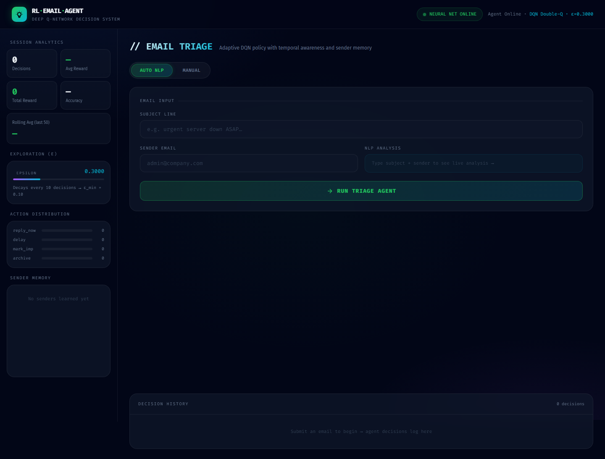
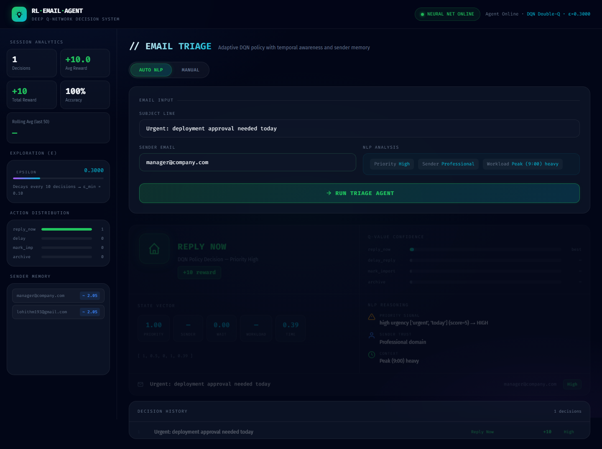

# Email Timing Response

An MLOps project that uses reinforcement learning to recommend the best action for an email based on urgency, sender importance, waiting time, workload, and time of day.

The project trains a Deep Q-Network (DQN) agent to choose one of four actions:

- `reply_now`
- `delay_reply`
- `mark_important`
- `archive`

It includes model training, inference APIs, a Flask web UI, monitoring hooks, Docker deployment files, and CI/CD automation.

<<<<<<< HEAD
1. [Project Overview](#project-overview)
2. [System Architecture](#system-architecture)
3. [Project Structure](#project-structure)
4. [Quick Start](#quick-start)
5. [Training the Agent](#training-the-agent)
6. [MLflow Experiment Tracking](#mlflow-experiment-tracking)
7. [Running the Inference API](#running-the-inference-api)
8. [Running Tests](#running-tests)
9. [Docker Deployment](#docker-deployment)
10. [Monitoring](#monitoring)
11. [Model Versioning](#model-versioning)
12. [CI/CD Pipeline](#cicd-pipeline)
=======
## Screenshots
>>>>>>> 729dc55db9c02ec9a9c0305798c8c49c755f0b64

### Web UI Dashboard



### Decision Result



### Training Reward Curves


## Project Overview

The system models email handling as a reinforcement-learning problem.

<<<<<<< HEAD
> Next-stage architecture for thread-aware Gmail automation, Gemini intelligence,
> human approval, feedback rewards, and analytics is documented in
> [NEXT_STAGE_ARCHITECTURE.md](NEXT_STAGE_ARCHITECTURE.md).

---
=======
| Item | Description |
| --- | --- |
| State | 5 features: priority, sender importance, waiting time, workload, time of day |
| Actions | 4 actions: reply now, delay reply, mark important, archive |
| Agent | Double DQN with replay buffer and target network |
| Reward | Custom reward function that favors timely responses to important emails |
| Serving | FastAPI inference API and Flask web UI |
| Monitoring | Metrics, logs, drift-detection utilities, and MLflow support |
>>>>>>> 729dc55db9c02ec9a9c0305798c8c49c755f0b64

## Architecture

<<<<<<< HEAD
```
┌─────────────────────────────────────────────────────────────────────┐
│                        EMAIL TIMING RESPONSE                        │
└─────────────────────────────────────────────────────────────────────┘

  DATA LAYER                 TRAINING LAYER            INFERENCE LAYER
  ──────────                 ──────────────            ───────────────
  ┌──────────┐               ┌───────────┐             ┌─────────────┐
  │ Enron    │               │ Trainer   │             │  FastAPI    │
  │ Dataset  ├──►EmailSim───►│  (DQN)   ├──►models/──►│  /predict   │
  └──────────┘               └─────┬─────┘             └──────┬──────┘
  ┌──────────┐                     │                          │
  │Synthetic │               ┌─────▼─────┐             ┌──────▼──────┐
  │Generator │               │  Email    │             │  Monitoring │
  └──────────┘               │  Environ- │             │  Metrics    │
                             │  ment     │             │  Drift      │
                             └─────┬─────┘             │  Logging    │
                                   │                   └─────────────┘
                             ┌─────▼─────┐
                             │  Reward   │
                             │Calculator │
                             └───────────┘

  MLOPS LAYER
  ───────────
  GitHub Actions: Lint ──► Tests ──► Docker Build ──► Deploy (staging)

  EXPERIMENT TRACKING
  ───────────────────
  MLflow: Params ──► Metrics ──► Artifacts ──► Model Registry
          │              │            │
          ▼              ▼            ▼
     Hyperparams   Episode Rewards  Weights (.pt)
     Source Info    Avg Reward       Reward Curves
     Algorithm     Epsilon Decay    Drift Reports
=======
```text
Data sources
    |
    v
Email simulation / feature extraction
    |
    v
RL environment + reward function
    |
    v
DQN training pipeline
    |
    v
Saved model weights
    |
    +--> FastAPI inference API
    |
    +--> Flask web UI
>>>>>>> 729dc55db9c02ec9a9c0305798c8c49c755f0b64
```

Main components:

| Path | Purpose |
| --- | --- |
| `agent/dqn.py` | DQN agent, Q-network, replay buffer, action selection |
| `environment/email_env.py` | Reinforcement-learning environment |
| `environment/reward.py` | Reward calculation logic |
| `simulation/` | Synthetic, Enron, terminal, NLP, and web email sources |
| `training/` | Trainer and evaluator |
| `pipelines/` | Training and inference pipeline entry points |
| `app/main.py` | FastAPI inference service |
<<<<<<< HEAD
| `monitoring/` | Structured logging, metrics, drift detection |
| `monitoring/mlflow_logger.py` | MLflow logging helpers for training & inference |
| `mlflow_config.py` | Centralised MLflow configuration |
| `pipelines/` | End-to-end training and batch inference |
| `tests/` | pytest unit + integration tests |
| `docker/Dockerfile` | Two-stage container image |
| `.github/workflows/ci_cd.yml` | Lint → Test → Build → Deploy |
=======
| `ui/web_ui.py` | Flask UI server |
| `ui/templates/index.html` | Browser interface |
| `monitoring/` | Logging, metrics, drift detection, MLflow tracking |
| `.github/workflows/ci_cd.yml` | CI/CD workflow |
>>>>>>> 729dc55db9c02ec9a9c0305798c8c49c755f0b64

## Setup

Create and activate a virtual environment:

<<<<<<< HEAD
```
email_timing_response/
│
├── app/                          # FastAPI inference service
│   ├── __init__.py
│   ├── main.py
│   ├── schemas.py
│   └── gmail_integration.py
│
├── monitoring/                   # Observability
│   ├── __init__.py
│   ├── drift_detection.py
│   ├── logging_config.py
│   ├── metrics.py
│   └── mlflow_logger.py          # MLflow logging utilities
│
├── tests/                        # pytest test suite
│   ├── __init__.py
│   ├── test_model.py
│   ├── test_api.py
│   ├── test_data.py
│   └── test_mlflow.py            # MLflow integration tests
│
├── pipelines/                    # MLOps pipelines (MLflow-tracked)
│   ├── __init__.py
│   ├── training_pipeline.py      # Full DQN training + MLflow
│   ├── inference_pipeline.py     # Batch inference + MLflow
│   ├── train_local_dqn.py        # Quick local training + MLflow
│   └── train_now.py              # Enron full training + MLflow
│
├── .github/workflows/ci_cd.yml   # CI/CD
├── docker/Dockerfile             # Container image
│
├── agent/                        # DQN agent 
│   ├── __init__.py
│   ├── base.py
│   ├── dqn.py
|   └── q_learning.py
│
├── data/                         # Email dataclass + Enron loader
│   ├── __init__.py
│   ├── email_data.py
│   └── enron_loader.py
│
├── environment/                  # RL environment
│   ├── __init__.py
│   ├── base.py
│   ├── email_env.py
|   └── reward.py
│
├── models/                       # Saved weights
│   ├── dqn_weights.pt
│   └── dqn.pkl
│
├── simulation/                   # Email simulators 
│   ├── sources/
│   ├── __init__.py
│   └── simulator.py
│
├── training/                     # Trainer + evaluator
│   ├── evaluator.py
|   └── trainer.py
│
├── ui/                           # Flask web UI
│   ├── templates/
│   │   ├── index.html
│   └── web_ui.py
│
├── utils/                        # Logger
│   ├── __init__.py
│   └── logger.py
│
├── scripts/                      # Utility scripts
│   └── mlflow_server.py          # Launch MLflow tracking UI
│
├── mlruns/                       # MLflow local tracking store (git-ignored)
│
├── .gitignore
├── .dockerignore
├── docker-compose.yml
├── pytest.ini
├── config.py
├── mlflow_config.py              # MLflow configuration
├── main.py
├── requirements.txt
├── README.md
└── DEPLOYMENT.md
```

---

## Quick Start

```bash
git clone <repo-url> && cd email_timing_response

# Create virtual environment
=======
```powershell
>>>>>>> 729dc55db9c02ec9a9c0305798c8c49c755f0b64
python -m venv venv
venv\Scripts\activate
```

Install dependencies:

```powershell
pip install -r requirements.txt
```

<<<<<<< HEAD
# Train (with MLflow tracking)
python pipelines/training_pipeline.py --episodes 10000

# View training runs in MLflow UI
python scripts/mlflow_server.py
# Open http://127.0.0.1:5050 in your browser

# Serve
=======
## Train The Model

Run the training pipeline:

```powershell
python pipelines\training_pipeline.py --episodes 10000
```

For a quicker local DQN run:

```powershell
python pipelines\train_local_dqn.py
```

Trained models are saved in:

```text
models/
```

The default DQN weights path is:

```text
models/dqn_weights.pt
```

## Run The FastAPI Inference API

Start the API:

```powershell
>>>>>>> 729dc55db9c02ec9a9c0305798c8c49c755f0b64
uvicorn app.main:app --reload --port 8000
```

Open the interactive API docs:

```text
http://127.0.0.1:8000/docs
```

Health check:

```powershell
Invoke-RestMethod -Uri "http://127.0.0.1:8000/health"
```

Prediction example:

```powershell
Invoke-RestMethod -Method POST `
  -Uri "http://127.0.0.1:8000/predict" `
  -ContentType "application/json" `
  -Body '{
    "subject": "Urgent meeting",
    "sender": "boss@company.com",
    "priority": 3,
    "sender_importance": 3,
    "waiting_time": 5,
    "workload": 2,
    "time_of_day": 14
  }'
```

## Run The Web UI

The repository also includes a Flask browser UI for trying the agent interactively.

<<<<<<< HEAD
```bash
# Full pipeline (versioned checkpoints + MLflow)
python pipelines/training_pipeline.py --episodes 10000 --source synthetic

# Train without MLflow tracking
python pipelines/training_pipeline.py --episodes 10000 --no-mlflow

# Legacy local script (MLflow-tracked)
python pipelines\train_local_dqn.py

# Colab: open train_colab.ipynb, run all cells, download models/dqn_weights.pt
=======
Start the UI:

```powershell
python ui\web_ui.py
>>>>>>> 729dc55db9c02ec9a9c0305798c8c49c755f0b64
```

Then open:

<<<<<<< HEAD
## MLflow Experiment Tracking

This project uses [MLflow](https://mlflow.org/) for comprehensive experiment tracking, model versioning, and monitoring.

### What Gets Tracked

| Pipeline | Logged Data |
|----------|------------|
| `training_pipeline.py` | Hyperparameters, per-episode rewards, epsilon decay, training duration, model weights, reward curves |
| `train_local_dqn.py` | Same as above for local quick training runs |
| `train_now.py` | Both Q-Learning and DQN runs tracked in separate experiments |
| `inference_pipeline.py` | Prediction counts, confidence stats, latency percentiles, drift reports |

### MLflow Experiments

| Experiment Name | Purpose |
|----------------|---------|
| `email-dqn-training` | All DQN training runs |
| `email-qlearning-training` | Q-Learning training runs |
| `email-inference-monitoring` | Batch inference metrics & drift |

### Launch the MLflow UI

```bash
# Start the tracking UI (default: http://127.0.0.1:5050)
python scripts/mlflow_server.py

# Custom port
python scripts/mlflow_server.py --port 8090
```

### Configuration

MLflow settings are centralised in `mlflow_config.py`:

```python
from mlflow_config import MLflowConfig

# Override tracking URI via environment variable:
# export MLFLOW_TRACKING_URI=http://your-mlflow-server:5000
```

### Architecture

```
mlflow_config.py                  ← Central configuration
    │
    ├── monitoring/mlflow_logger.py ← Reusable logging helpers
    │       │
    │       ├── log_training_params()
    │       ├── log_episode_metrics()
    │       ├── log_evaluation_results()
    │       ├── log_model_artifact()
    │       ├── log_reward_curve()
    │       ├── log_drift_report()
    │       └── log_inference_metrics()
    │
    ├── pipelines/training_pipeline.py  ← Uses helpers above
    ├── pipelines/train_local_dqn.py    ← Uses helpers above
    ├── pipelines/train_now.py          ← Uses helpers above
    └── pipelines/inference_pipeline.py ← Uses helpers above
```

---

## Running the Inference API

```bash
uvicorn app.main:app --reload --host 0.0.0.0 --port 8000
=======
```text
http://127.0.0.1:5000
>>>>>>> 729dc55db9c02ec9a9c0305798c8c49c755f0b64
```

The UI has two modes:

| Mode | Description |
| --- | --- |
| Auto mode | Enter subject and sender. NLP-style feature extraction estimates priority, sender importance, workload, and waiting time. |
| Manual mode | Use sliders to manually provide priority, sender importance, waiting time, workload, and time of day. |

Useful UI endpoints:

| Endpoint | Purpose |
| --- | --- |
| `GET /` | Render the web UI |
| `GET /agent_status` | Show agent mode and epsilon |
| `GET /debug` | Show session stats, sender memory, and model details |
| `POST /infer` | Live feature preview while typing |
| `POST /decide_nlp` | Auto-mode action recommendation |
| `POST /decide` | Manual-mode action recommendation |

## Run Tests

```powershell
pytest
```

<<<<<<< HEAD
Test modules:
- `test_model.py` — DQN agent, Q-Network, ReplayBuffer
- `test_api.py` — FastAPI endpoint integration tests
- `test_data.py` — Email dataclass, reward calculator, environment
- `test_mlflow.py` — MLflow configuration, logger helpers, tracking

---
=======
Run with coverage:
>>>>>>> 729dc55db9c02ec9a9c0305798c8c49c755f0b64

```powershell
pytest --cov
```

## Docker

Build the image:

<<<<<<< HEAD
| File | Contents |
|------|----------|
| `logs/app.log` | JSON structured logs (rotating 5 MB × 5) |
| `logs/metrics.json` | Prediction counts, confidence, latency percentiles |
| `logs/drift_report.json` | Per-feature PSI drift scores and alerts |
| `mlruns/` | MLflow experiment tracking data (params, metrics, artifacts) |

---

## Model Versioning

```
models/
├── dqn_weights.pt                  # default (latest training)
├── dqn_weights_20250510_0930.pt    # timestamped checkpoint
└── dqn.pkl                         # legacy pickle fallback
=======
```powershell
docker build -f docker\Dockerfile -t email-timing-response .
>>>>>>> 729dc55db9c02ec9a9c0305798c8c49c755f0b64
```

Run with Docker Compose:

```powershell
docker compose up --build
```

## CI/CD

The GitHub Actions workflow in `.github/workflows/ci_cd.yml` is intended to automate:

- dependency installation
- code quality checks
- tests
- Docker build
- deployment steps

## Typical Workflow

<<<<<<< HEAD


=======
1. Install dependencies.
2. Train the model or use the existing weights in `models/`.
3. Run the FastAPI service for programmatic inference.
4. Run the Flask UI for an interactive demo.
5. Use tests and CI/CD to validate changes.

## Notes

- If the API returns `Model not loaded`, check that `models/dqn_weights.pt` exists.
- If the UI starts slowly, it is usually loading the trained agent.
- The Flask UI performs online learning during interaction, so session metrics can change as you submit more examples.
>>>>>>> 729dc55db9c02ec9a9c0305798c8c49c755f0b64
